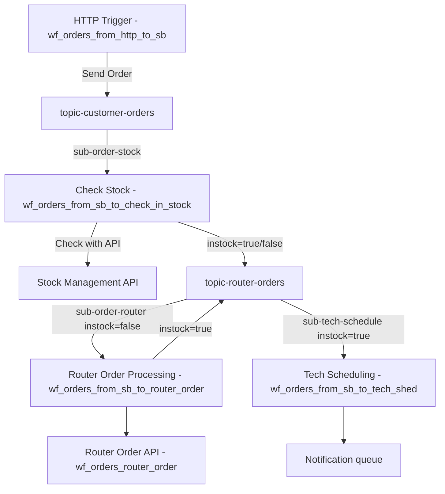

# Router Order - Azure Integration Services Solution

This project showcases an Azure Integration Services solution designed for a hypothetical scenario in which a customer places an order for an Internet router. The workflows manage customer requests, stock verification, router orders, and scheduling of technician interventions.

## Architecture


The solution includes several Logic App workflows:

- **wf_orders_from_http_to_sb**: Receives router orders in JSON format via HTTP (through APIM) and sends them to the Customer Order topic.
- **wf_orders_from_sb_to_check_in_stock**: Subscribes to Customer Order topic and calls an API (on APIM) to check if the router is in stock. XSLT transformation is applied and then, based on the response of the API call (default mocked response is "Not in Stock"), the workflow sets the custom property "instock" to `false` and publishes the message to the Router Order topic.
- **wf_orders_from_sb_to_router_order**: Subscribes to Router Order topic with a filter on custom property "instock" set to `false`, calls an asynchronous API to order a router, poll for the response and, if successful, publishes to the Router Order topic with custom property "instock" set to `true`.
- **wf_orders_router_order**: A mocked API that simulates a long-running task, such as provisioning a router, and returns an HTTP code 200 after a 1 minute delay.
- **wf_orders_from_sb_to_tech_shed**: Subscribes to Router Order topic custom property "instock" to `true` and queues a message in a notification queue. You can add a custom scheduling logic in between.



## Prerequisites

- [Azure Developer CLI](https://docs.microsoft.com/azure/developer/azure-developer-cli/install-azd)
- [.NET 6.0 SDK or later](https://dotnet.microsoft.com/download)
- [Azure subscription](https://azure.microsoft.com/free/)
- [Azure CLI](https://docs.microsoft.com/cli/azure/install-azure-cli)
- [PowerShell 7.0 or later](https://docs.microsoft.com/powershell/scripting/install/installing-powershell) (for Windows deployment)
- [Node.js 18 or later](https://nodejs.org/) (for running tests)
- [Visual Studio Code](https://code.visualstudio.com/) with [Azure Logic Apps (Standard) extension](https://marketplace.visualstudio.com/items?itemName=ms-azuretools.vscode-azurelogicapps)

## Project Structure

```
router-order/
├── .github/
│   └── workflows/          # CI/CD GitHub Actions workflows
│       └── ci.yml          # Continuous Integration workflow
├── .vscode/                # VS Code configuration for Logic Apps development
│   ├── extensions.json     # Recommended VS Code extensions
│   ├── launch.json         # Debug configurations
│   ├── settings.json       # Workspace settings
│   └── tasks.json          # Build and test tasks
├── api/                    # API definitions (OpenAPI/Swagger)
│   ├── order-process/      # Order processing API definition
│   │   └── openapi.yaml
│   └── stock-management/   # Stock management API definition
│       └── openapi.yaml
├── infra/                  # Infrastructure as Code (Bicep)
│   ├── modules/            # Bicep modules
│   │   ├── apim.bicep              # API Management
│   │   ├── application-insights.bicep
│   │   ├── logic-app.bicep         # Logic App (Standard)
│   │   ├── role-assignment.bicep   # RBAC assignments
│   │   ├── servicebus.bicep        # Service Bus
│   │   └── storage.bicep           # Storage Account
│   ├── abbreviations.json  # Resource naming abbreviations
│   ├── main.bicep          # Main infrastructure template
│   └── main.parameters.json
├── logicapp/               # Logic App Standard project
│   ├── Artifacts/
│   │   └── Maps/           # XSLT transformations
│   │       └── transformation_router.xslt
│   ├── wf_orders_from_http_to_sb/      # HTTP trigger workflow
│   │   └── workflow.json
│   ├── wf_orders_from_sb_to_check_in_stock/  # Stock check workflow
│   │   └── workflow.json
│   ├── wf_orders_from_sb_to_router_order/    # Router order workflow
│   │   └── workflow.json
│   ├── wf_orders_from_sb_to_tech_shed/       # Tech scheduling workflow
│   │   └── workflow.json
│   ├── wf_orders_router_order/               # Mock order API workflow
│   │   └── workflow.json
│   ├── connections.json    # Connection definitions
│   ├── host.json           # Host configuration
│   ├── local.settings.json.example  # Example local settings
│   └── parameters.json     # Workflow parameters
├── scripts/                # Deployment scripts
│   └── postprovision.ps1   # Post-deployment configuration
├── tests/                  # Test suite
│   ├── fixtures/           # Test data
│   ├── functional/         # Functional tests
│   └── unit/               # Unit tests
├── azure.yaml              # Azure Developer CLI configuration
├── sample_order.json       # Sample order payload
└── README.md
```

## Local Development

### Setting Up Your Development Environment

1. **Install VS Code Extensions**
   
   Open the project in VS Code and install the recommended extensions when prompted, or run:
   ```bash
   code --install-extension ms-azuretools.vscode-azurelogicapps
   code --install-extension ms-azuretools.vscode-azurefunctions
   ```

2. **Configure Local Settings**
   
   Copy the example settings file and update with your values:
   ```bash
   cp logicapp/local.settings.json.example logicapp/local.settings.json
   ```
   
   Update the values in `local.settings.json` with your Azure resource details.

3. **Start the Logic App Locally**
   
   Use VS Code tasks or run:
   ```bash
   cd logicapp
   func start
   ```

### Running Tests

The project includes comprehensive unit and functional tests.

1. **Install test dependencies**
   ```bash
   cd tests
   npm install
   ```

2. **Run all tests**
   ```bash
   npm test
   ```

3. **Run unit tests only**
   ```bash
   npm run test:unit
   ```

4. **Run functional tests only**
   ```bash
   npm run test:functional
   ```

5. **Run tests with watch mode**
   ```bash
   npm run test:watch
   ```

### Test Categories

- **Unit Tests** (`tests/unit/`)
  - Workflow definition validation
  - Order schema validation
  - Stock response schema validation

- **Functional Tests** (`tests/functional/`)
  - XSLT transformation testing
  - API definition validation
  - Infrastructure template validation

## Deployment Steps

1. **Clone and Setup**
   ```bash
   git clone <repo-url>
   cd router-order
   ```

2. **Configure Environment (optional)**
   Set up the Azure Developer CLI environment variables:
   ```bash
   azd env new yourenvironmentname
   azd env set AZURE_SUBSCRIPTION_ID "your subscription GUID"
   azd env set AZURE_LOCATION "your Azure location"
   azd env set APIM_PUBLISHER_EMAIL "your.email@domain.com"
   azd env set APIM_PUBLISHER_NAME "Your Company Name"
   ```

3. **Login to Azure**
   ```bash
   az login
   azd auth login
   ```

4. **Deploy the Solution**
   ```bash
   azd up
   ```
   This command will:
   - Create a new resource group
   - Deploy all Azure resources using Bicep templates
   - Deploy and configure Logic App workflows
   - Set up Service Bus topics, subscriptions, and queues
   - Configure API Management
   - Set up necessary role assignments and permissions

5. **Verify Deployment**
   After deployment completes:
   - Check the Azure Portal to ensure all resources are created
   - Verify the Logic App workflows are running
   - Test the API endpoints through API Management

## Clean Up

To remove all deployed resources:

```bash
azd down
```

This will delete:
- The resource group and all contained resources
- All deployed Logic Apps and their connections
- Service Bus namespace and all messaging entities
- API Management instance
- Storage accounts and their data

## CI/CD

This project includes a GitHub Actions workflow (`.github/workflows/ci.yml`) that:
- Runs unit and functional tests
- Validates Bicep templates
- Validates workflow JSON files

The workflow runs automatically on:
- Push to `main` branch
- Push to `feature/*` branches
- Pull requests to `main` branch

## Best Practices Implemented

This project follows Azure Logic Apps best practices:

1. **Project Organization**: Clear separation of workflows, artifacts, and infrastructure
2. **Configuration Management**: Uses `host.json`, `connections.json`, and `parameters.json` per Microsoft guidelines
3. **VS Code Integration**: Full support for the Azure Logic Apps (Standard) extension
4. **Security**: Uses Managed Identity for Service Bus connections
5. **Modular Infrastructure**: Bicep templates are modularized for maintainability
6. **Testing**: Comprehensive unit and functional test suite
7. **CI/CD**: Automated testing and validation pipeline

## Contributing

Contributions are welcome! Please:

1. Fork the repository
2. Create a feature branch
3. Make your changes
4. Run tests to ensure they pass
5. Submit a Pull Request

## License

This project is licensed under the MIT License - see the LICENSE file for details.